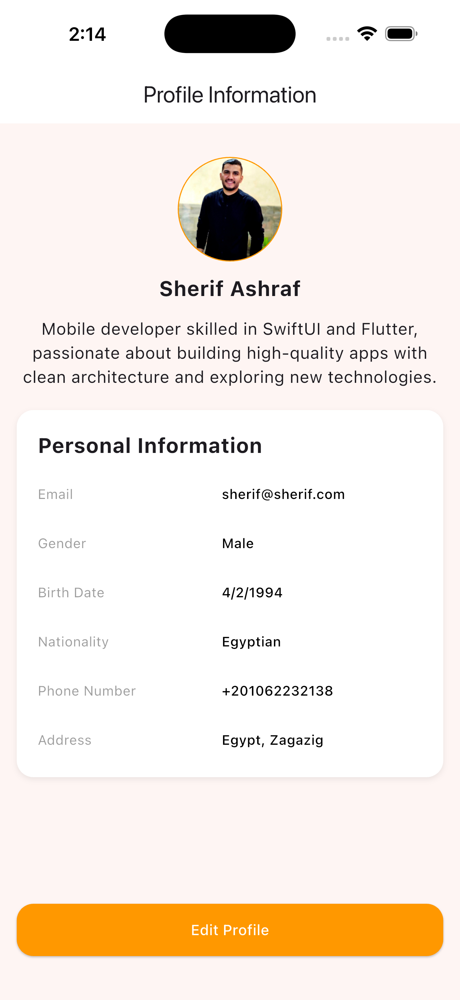
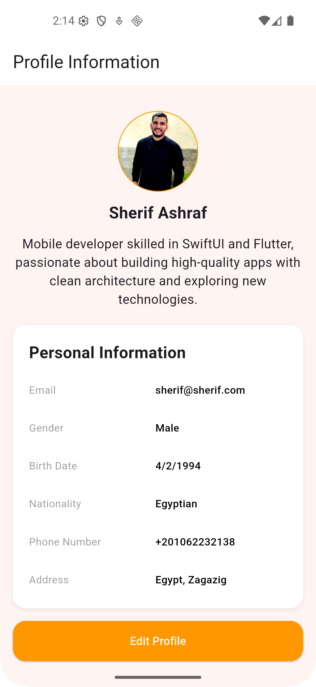

# Profile demo app with flutter

A **single-page Flutter profile UI** that displays user information including profile picture, bio, and personal details like email, gender, date of birth, nationality, phone number, and address. Features a modern, scrollable layout with placeholders for images and an **“Edit Profile”** button.

---

## Features

- Clean, scrollable, and mobile-friendly profile screen.
- Circular profile image with network loading, placeholder, and error handling.
- Displays user name, bio, and personal information (email, gender, birth date, nationality, phone, address).
- Modern styling with rounded containers, shadows, and consistent spacing.
- Responsive layout for different screen sizes.
- “Edit Profile” button at the bottom (placeholder for future functionality).

---

## Screenshots

### Profile Screen - iPhone 17 Pro Max

### Profile Screen - Pixel 5

